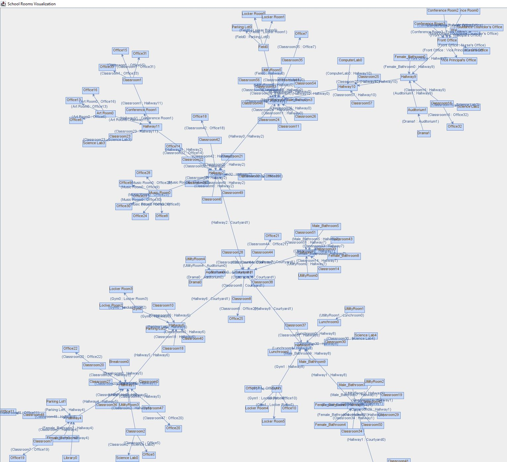
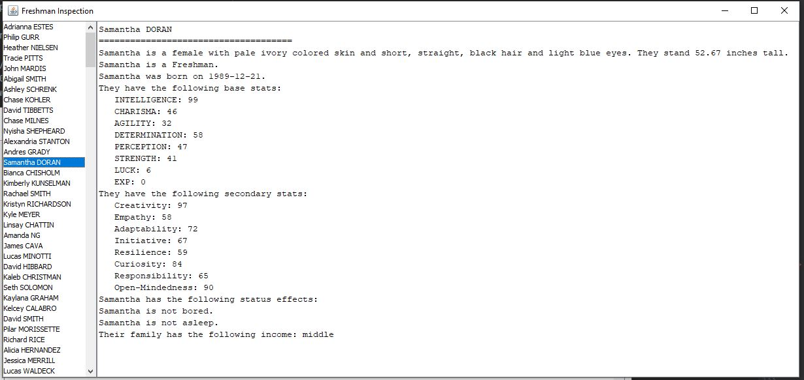
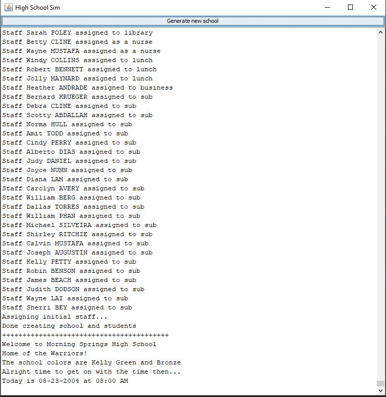

# Generation '04

***Originally a school project that has been modified***

## Intro

This project is a detailed RPG/Slice-of-Life sim of an American high school which begins in the year 2004. The player
creates and controls the daily life of a unique student while the aspirations and goals of other generated students and
staff play out around them.

This project explores the use of GoF patterns:

I used a Builder design pattern to procedurally generate a high school and all specific rooms/ classrooms. Rooms are an
interface that serve as a template for specific room objects. A director object assembles the school by organizing a
series of concrete builders. From the builder, I used the school size (via number of classrooms and offices) to
calculate the maximum number of students and minimum number of staff needed to run a school.

Next, I developed an Abstract Factory to build different types of People (staff and students) using components that make
up a person, defined through an Interface. Students and staff are stored in separate hash maps for quick reference.
People are then generated with attributes and stats. There are no "races" in this, like a typical RPG, but students and
teachers have a chance at different base stats. Students and teachers can equip items to different parts of their bodies
which are objects in themselves.

I used a Singleton design pattern to generate days. The days act as a form of step within the state machine that is the
school and the people that attend/work at the school.

## School Generation

### Data Structure and Libraries for Rooms

Rooms are initially stored in a series of arrays (one for each room type) within the StandardSchool object. When the
Director spins up, it initiates a StandardSchool object, which fills these arrays with a random amount of each room
type. When rooms need to be connected, they are transferred to a 2-D array of Room objects called roomPool. We can
reference a particular room type within the pool by checking the int value on the first axis of the array which always
corresponds to a particular array of rooms. The **jgrapht** library is used to create a multigraph object for storing
vertices and edges. The multigraph is an undirected, unweighted graph. **Mxgraph** , **swing** and **jgrapht** are used
for generating a visualization of the graph after rooms are connected.

### Procedure

The layout of the high school is semi-procedurally generated. First, individual rooms are created. Then the "backbone"
of the school is constructed using hallways and courtyards. Hallways and courtyards are randomly connected using an
undirected graph. A connectivity inspector ensures that all backbone rooms are traversable from any other room. After
the backbone is constructed rooms are procedurally added to the backbone or other rooms in the following order:

- Athletic Fields
- Auditoriums
- Gyms
- Lunchrooms
- Libraries
- Music Rooms
- Art Rooms
- Drama Rooms
- Offices
- Student Bathrooms
- Classrooms
- Science Labs
- Computer Labs
- Utility Rooms
- Breakrooms
- Conference Rooms
- Parking Lots
- Vocational Rooms

The front office will always contain a connection to the principal and vice principal's office as well as the nurse's
office and any conference rooms. Breakrooms and planning rooms may be attached to the front office cluster in the
future. Science rooms will always have a connected lab. Gyms and fields will always have connections to two locker
rooms. Offices have a chance to be connected to classrooms. Computer labs will preference connecting to libraries. Drama
rooms have a chance of connecting to auditoriums.

Each room is an object that holds stats. First, student and teacher capacity is mainly determined by the number of
available classrooms. Each classroom can hold around 20 - 45 students and, generally, a school may contain anywhere from
18-60 classrooms. Rooms also contain a fixed number of connections/doors as well as windows (if it applies). If a
connection is made during the generation, then the number of available connections is reduced on each room by one. This
is meant to generate layouts that are more realistic. For example, classrooms shouldn't have more than a handful of
doors, adjacent rooms. Classrooms are randomly assigned types (science, math, english, social studies, homerooms). All
rooms are randomly assigned generated room numbers.

Rooms also have the ability to be off-limits to students, by setting the setStudentRestriction switch.

The school mascot is generated from a weighted list based on the most frequently to least frequently used mascots in US
high schools. The high school name is either a randomly generated person (presumably important in the fictionalized
community) or a randomly concatinated place name (Place1 + Place2) where, generally, most combinations make sense.

### Example of School Room Map

*Coming soon*

- School schedules/ bell schedule
- Initial school state machine
- More status effects for people
- Social links as weighted graphs
- Items
- Siblings
- Moods
- Nicknames
- Rival schools
- More accurate descriptors of teachers based on age
- Household and personal traits
- Graduation requirements
- Rumors
- School and extracurricular events
- Local businesses / points of interest

## Student and Staff Stat Generation

### Data Structure and Libraries for People

Both staff and students are stored in their own HashMap<Integer, Person> objects. Students are further sorted into their
individual graduating classes after they are generated (i.e. freshmen).

### Procedure

Students and staff are comprised of individual body parts as described above. Once student and staff caps are known
based on the school layout, StudentPopGenerator and TeacherPopGenerator are called. They populate each hasmap with the
appropriate amount of people. An important component of each type of person is their respective "Stats" portion which
holds vital information for each individual to participate in the simulation. The stats portion also holds the name
generator. Each first and last name is generated by referencing a corresponding weighted distribution. This depends on
the individual's gender and birth year. For example, if a person was born 1989-01-12 and is a male, then "yob1989.txt"
will be referenced. These "yob" files contain U.S. census data from a corresponding year of a list of names from most to
least frequently used. This is meant to generate relatively accurate populations of students. Similarly, other physical
characteristics, such as height, eye color and hair color are relatively accurate to the US population. Height is a
normalized distribution based on age and gender.

### Example Student Generation

An example of a student generated and displayed in the inspector:

### Example Staff Generation

An example of a staff generated and displayed in the inspector:

## Datasets and References

- US Census Data for Surnames (Use File B) :  https://www.census.gov/topics/population/genealogy/data/2000_surnames.html
- US Census Data for First Names : https://www.ssa.gov/oact/babynames/limits.html (Use the National Data folder)
- US Mascot Frequency Database : https://masseyratings.com/mascots
- US Height Data Per Age Range : https://www.cincinnatichildrens.org/health/g/normal-growth
- Hair Color Distribution : https://beautytmr.medium.com/diversity-of-hair-types-b3615cec8ed8
- Hair Length Approximation : https://pubmed.ncbi.nlm.nih.gov/12644859/
- Eye Color Distribution : https://www.verywellhealth.com/what-is-the-rarest-eye-color-5087302
- US High School Colors
  Reference : https://www.quora.com/What-are-the-most-popular-high-school-color-combinations-in-the-US
- Hair types by race (
  General) : https://www.researchgate.net/figure/a-Demographics-of-sample-population-n-48-of-8-hair-curl-groups-Hair-geometric_fig1_317578316
- Skin tone and color
  descriptors : https://writingwithcolor.tumblr.com/post/96830966357/words-for-skin-tone-how-to-describe-skin-color
- Staff Averages Per School : https://nces.ed.gov/pubs2007/ruraled/tables/table3_12.asp
- Approximate Household income distribution : https://www.pewresearch.org/short-reads/2022/04/20/how-the-american-middle-class-has-changed-in-the-past-five-decades/
- Weather Data per region : https://www.ncei.noaa.gov/access/search/data-search/daily-summaries

## Gameplay Mechanics

Student and teacher stats are comprised of the following primary stats. Primary stats are inherent to the characters and
do not change:

- INT / Intelligence:
- CHR / Charisma:
- AGL / Agility:
- DET / Determination:
- PER / Perception:
- STR / Strength:
- LCK / Luck:

Secondary stats are derived from a combination of primary stats and are capable of being drained through activities or
events. Initial values for the secondary stats represent a maximum. Secondary stats can be recharged with rest or other
activities, but they cannot be pushed beyond their initial cap.

- CRE / Creativity: This represents a combination primarily of intelligence and perception. This is the max ability of a
  person to create solutions, projects, ideas etc. that are unique.
- EMP / Empathy: This is driven primarily by charisma and intelligence. This is the max ability of a person to
  understand the complex emotional states and situations of others.
- ADP / Adaptability: This is a combination of agility and intelligence, each which represent the physical and mental
  ability to adapt to new situations. Determination also plays a factor in this cap.
- INT / Initiative: This stat is a combination of the determination to take action and the perception to see that an
  action needs to be taken. This is the max ability of someone to take action without the external influence of others.
- RES / Resilience: This stat is a combination of strength and determination. This is the max ability of someone to
  withstand the pressure or adversity of various events or peers
- CUR / Curiosity: This is a combination of primarily perception and intelligence. This represents a person's desire to
  not only understand the ideas and people around them, but also make useful connections between concepts
- RSP / Responsibility: This is a combination of charisma and determination. This not only represents a personal
  responsibility (to carry out daily tasks/ do socially responsible things) but also the ability to instill or influence
  responsible behavior in others.
- OPN / Open-Mindedness: This is a combination of intelligence and charisma. This represents the ability for the
  individual receive new ideas and accept situations and others that might exist outside their comfort-zone.

### Known Bugs

- Graph visualization of rooms can be hard to read due to overlapping labels
- Graph visualization of rooms cannot handle dragging of connections/ allows connections to be moved
- Initial staff assignment is not efficient and sometimes runs out of available teachers

## Release 0.0.7

- New system : Weather
- Staff inspection for individual staff
- Student inspection for individual students
- AM and PM weather displayed in main view
- Basic UI cleanup

## Release 0.0.6

- New stat : Luck (LCK)
- Students now have initial family income levels when generated
- Staff assignments tweaked to be less wasteful
- Basic room inspection added in Inspector
- Staff are now assigned to specific rooms
- GUI prototype has been constructed and output has been moved away from reporting to console
- GUI updates in realtime as school is generated
- Java project SDK upgraded from 11 to 17

## Release 0.0.5

- New room types: vocational rooms
- Generated staff are now assigned responsibilities
- Added a framework of possible classes that students can be enrolled in
- Added outlines and ideas for characteristic traits
- Some students may have suffixes (Jr, II, III, IV)

## Release 0.0.4

- Hair color, skin color, hair type distributions are now dependent on and weighted by race
- Added school colors and more names to school name randomizer. Schools may now only have one name (i.e. Millennium High
  School)
- Fixed bug where all students had female hair lengths
- Some students may have vitiligo, alopecia, albinism, or heterochromia iridium

## Release 0.0.3

- Surnames are now a weighted choice based on US census data
- Students are assigned race based on surname distributions (reference app_c.csv)
- Performance fixes on student and staff name generation by reading docs into memory first
- Minor bug fixes

## Release 0.0.2

- Use string builder for student and staff inspection
- Staff and students have hair types and lengths
- Updated descriptions for students and staff to be more natural and informative
- Minor optimizations

## Release 0.0.1

- Procedurally generated schools can be populated by a number of students and staff
- Schools contain classrooms and room types, mascots, school colors, and a generated school name
- Students and staff have primary and secondary stats that are generated on a normal distribution
- Student and staff names are generated based on US census data
- School rooms are automatically connected and represented as a contiguous, undirected graph. It can be visualized
  through Swing/JGraphX
- Students are automatically sorted to appropriate grade levels based on birthdays
- Inspectors are available for debugging and viewing individual staff/students
- Time is represented and can be advanced by days/hours
- Basic quiz and test system to challenge student stat system

**Disclaimer:** *The story, all names, characters, and incidents portrayed in this game are fictitious and randomly
generated. No identification with actual persons (living or deceased), places, buildings, and products is intended or
should be inferred.* 